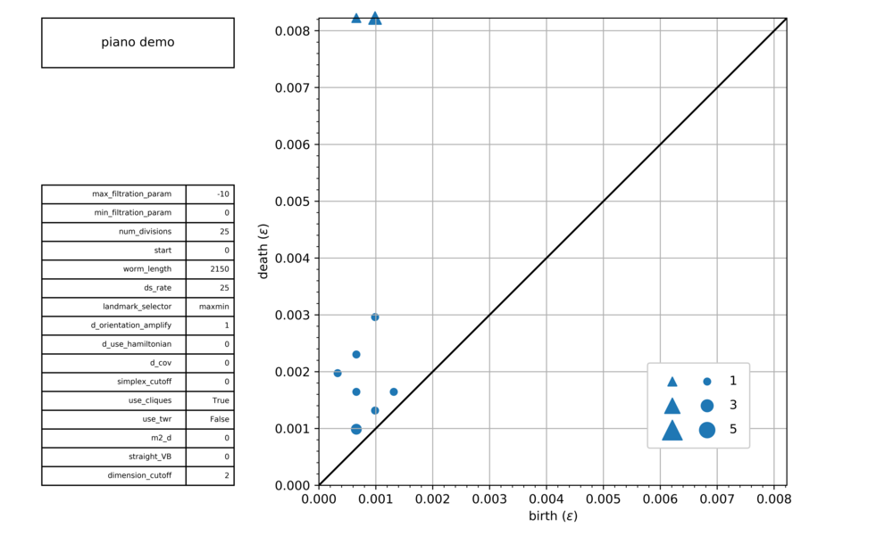
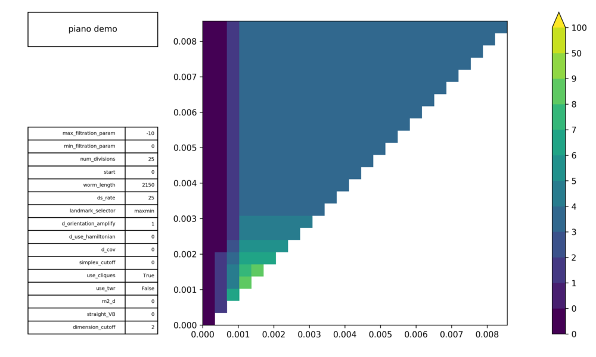
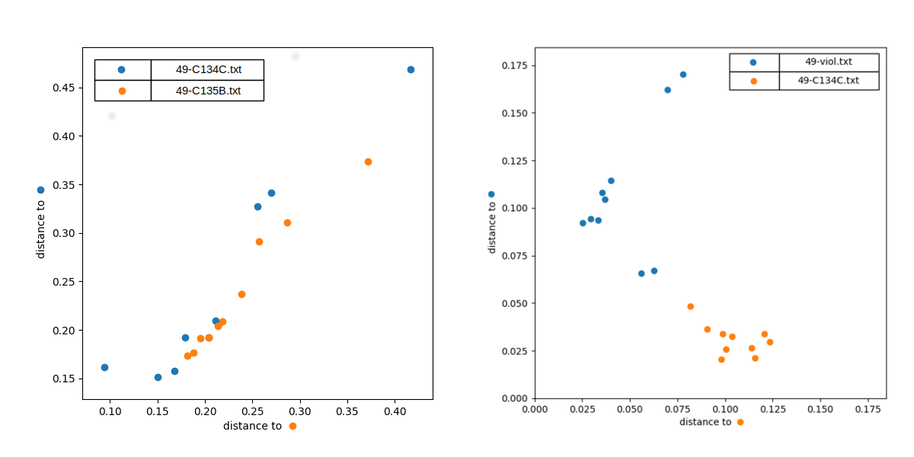

## Synopsis

**P**ersistent **H**omology on **E**mbedded **T**ime-**S**eries

This module offers high-level tools for exploration and visualization of delay coordinate 
embedding and persistent homology. It is used to investigate the utilization of these tools together as a signal 
processing technique.

Also included is a dataset of time-series (mostly musical instrument recordings) and 
higher dimensional trajectories as .txt files.


## Installation

### Dependencies
* Python 2.7
* GCC 5
* popt.h
* ffmpeg
* gnuplot


### Setup

#### Install Dependencies


###### Popt
```bash
wget http://rpm5.org/files/popt/popt-1.16.tar.gz
tar -xvzf popt-1.16.tar.gz
cd popt-1.16
./configure --prefix=/usr --disable-static &&
make
sudo make install
export LD_RUN_PATH="/usr/lib"
```

###### ffmpeg and gnuplot
```bash
sudo apt-get install ffmpeg
sudo apt-get install gnuplot
```

#### Install PHETS

```bash
git clone https://github.com/eeshugerman/PHETS.git
cd PHETS
pip install -r requirements.txt
```


## Usage
```python
import numpy as np
import DCE, Tools
from PH import Filtration, make_movie, make_PD, make_PRF_plot
from config import default_filtration_params as filt_params
time_units = 'seconds'                  # 'seconds' or 'samples'
crop = (1, 5)                           # range of signal
tau = (1 / Tools.idx_to_freq(49)) / np.pi	# embedding delay
m = 2 				        # embedding dimension

sig = np.loadtxt('datasets/time_series/C135B/49-C135B.txt') # this is a middle C from a piano

trajs = DCE.Movies.slide_window(    # other options here include vary_tau() and compare_multi()
	sig,
	'output/demo/embed_movie.mp4',
	tau=tau,
	m=m,
	window_size=.05, 
	window_step=.02,        
	crop=crop,
	time_units=time_units,
	title='piano demo'
)
```


```python
traj = trajs[100]		# take embedding from 100th frame of movie

# alternatively, we could embed explicitly:
# traj = embed(sig, tau, m, crop=crop, time_units=time_units)		

# parameters used to build the filtration:
filt_params.update(
	{
		'ds_rate': 25,      # num landmarks = len(sig) / ds_rate
		'num_divisions': 25,  # number of epsilon vals in filtration
		# 'max_filtration_param': .05,  # if positive, explicit;
		'max_filtration_param': -10,  # if negative, cuts off filtration at first 10 dim simplex
		'use_cliques': True,
	}
)

# build the filtration:
filt = Filtration(traj, filt_params, title='piano demo')

make_movie(filt, 'output/demo/filt_movie.mp4')
```


```
This filtration can be summarized by its homology, which may be expressed as a persistence diagram or persistence rank function:
python

```python
make_PD(filt, 'output/demo/PD.png')  # make the persistence diagram
```



```python
make_PRF_plot(filt, 'output/demo/PRF.png')  # make persistence rank function
```



Persistence rank functions are amenable to statistical analysis. Several functions are provided for exploring these properties.
`PRFCompare.plot_clusters()`, for example, takes two disjoint sets of samples ('training' and 'test') from each of two input signals,
computes the mean PRF for each training set, and plots the L2 distances from these means to the PRFs of the test sets. 
In the image below, two pianos are compared (left) and not easily distinguished; a viol and a clarinet are compared (right) and clustering is observed.



See `reference.pdf` for more information.

