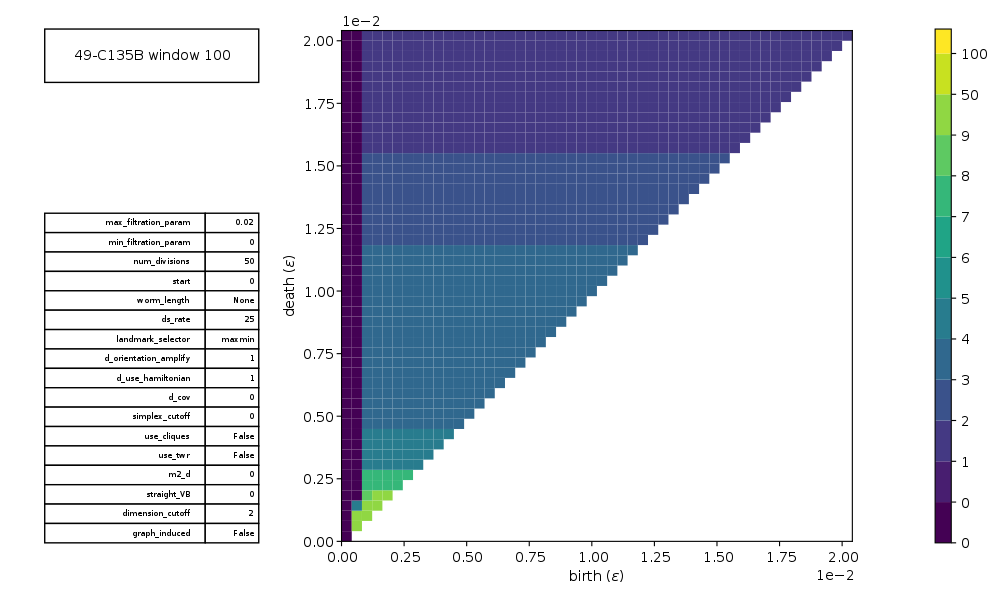

## Synopsis

**P**ersistent **H**omology on **E**mbedded **T**ime-**S**eries

This package offers high-level tools for exploration and visualization
of delay coordinate embedding and persistent homology. It is used to
investigate the utilization of these together as a signal processing
technique. Also included is a dataset of time-series (mostly musical
instrument recordings) and higher dimensional trajectories as .txt files.

PHETS uses [Perseus](http://people.maths.ox.ac.uk/nanda/perseus/) to
compute persistent homology.

PHETS was originally developed for the research detailed 
[here](https://arxiv.org/pdf/1708.09359.pdf). If you find PHETS useful 
in your research work, please cite [N. Sanderson, E. Shugerman, S. Molnar, J. Meiss, and E. Bradley, "Computational Topology Techniques for Characterizing Time-Series Data", IDA-17 (Proceedings of the 13th International Symposium on Intelligent Data Analysis), London, October 2017](http://arxiv.org/abs/1708.09359): 

Please direct inquires to lizb@colorado.edu.


## Installation

### Dependencies
* Python 2.7
* ffmpeg
* gnuplot (with pngcairo)


##### Debian-based 
```bash
sudo apt-get install ffmpeg
sudo apt-get install gnuplot-x11
```

##### macOS
```bash
brew install ffmpeg
brew install gnuplot --with-cairo
```
If you're running into an error about compiling `find_landmarks.c`, see
the trouble shooting section of `documentation.pdf` for information
about C compiler / library dependencies on macOS.


#### Install PHETS

```bash
git clone https://github.com/eeshugerman/PHETS.git
cd PHETS
pip install -r requirements.txt
```


## Demo
```python

import numpy as np
from signals import TimeSeries
from utilities import idx_to_freq
from DCE.movies import slide_window
from PH import Filtration
from config import default_filtration_params as filt_params

ts = TimeSeries(
    'datasets/time_series/C135B/49-C135B.txt',
    crop=(0, 5),
    num_windows=250,
    window_length=.05,
    time_units='seconds'    # defaults to 'samples'
)

# the slide_window function will create a movie showing an embedding for each
# window of the time series and return the trajectory

tau = (1 / idx_to_freq(49)) / np.pi      # first, choose tau = period / pi 

traj = slide_window(ts, 'output/demo/embed_movie.mp4', m=2, tau=tau)

```


```python
# alternatively, we could skip the movie and embed explicitly:
traj = ts.embed(m=2, tau=tau)

# now, lets build a filtration from the trajectory that is shown in the 100th 
# frame of the slide_window movie
traj_window = traj.windows[100]

# parameters used to build the filtration:
filt_params.update(
    {
        'ds_rate': 25,
        'num_divisions': 10,                # number of epsilon vals in filtration
        # 'max_filtration_param': .05,      # if > 0, explicit
        'max_filtration_param': -10,        # if < 0, stops st first 10 dim simplex
        # 'use_cliques': True,
    }
)

# build the filtration:
filt = Filtration(traj_window, filt_params)

filt.movie('output/demo/filt_movie.mp4')

```


A filtration can be summarized by its homology, which may be expressed as a persistence rank function:

Or as a persistence rank function:
```python
filt.plot_prf('output/demo/prf.png')        # plot the persistence rank function
```



Persistence rank functions are amenable to statistical analysis. `prfstats.L2Classifier`, upon initialization, computes
a mean PRF and variance from a set of training PRFs; subsequently, `L2Classifier.predict(PRF, k)` returns `True` if the L2 distance from `PRF` to the mean PRF is smaller than `k` times the standard deviation. `prfstats.plot_l2rocs` takes two pre-windowed `Trajectory`s, `traj1` and `traj2`,
and partitions the windows roughly as follows:
```
windows1, windows2 = traj1.windows, = traj2.windows
train1, test1 = windows1[1::2], windows1[::2]
train2, test2 = windows2[1::2], windows2[::2]
```

Two `L2Classifier`s are initialized:

```
clf1 = L2Classifier(train1)
clf2 = L2Classifier(train2)
```

`clf1.predict` and `clf2.predict` are each called on both `test1` and `test2` for a range of `k`, and the results are plotted as ROC curves.

```
traj1 = TimeSeries(
    'datasets/time_series/clarinet/sustained/high_quality/40-clarinet-HQ.txt',
    crop=(75000, 180000),
    num_windows=50,
    window_length=1500,
    vol_norm=(0, 0, 1)  # (full, crop, windows)
).embed(tau=32, m=2)


traj2 = TimeSeries(
    'datasets/time_series/viol/40-viol.txt',
    crop=(35000, 140000),
    num_windows=50,
    window_length=1500,
    vol_norm=(0, 0, 1)
).embed(tau=32, m=2)


filt_params.update({
    'max_filtration_param': -21,
    'num_divisions': 20,
    'ds_rate': 20
})

plot_l2rocs(
    traj1, traj2,
    'clarinet', 'viol',
    'output/demo/ROCs.png',
    filt_params,
    k=(0, 10.01, .01),
)

```

For this case, at least, the classifiers preform very well:


